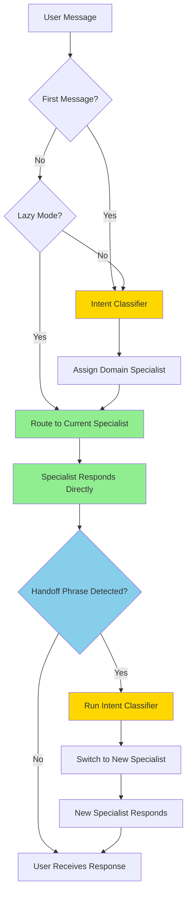

# Handoff Multi-Domain Agent

## Overview

A scalable domain-based routing pattern for customer support that enables **direct specialist-to-user communication** with intelligent handoff detection. Specialists handle requests within their domain autonomously, and routing only occurs when a request falls outside their expertise.

## Core Concept: Lazy Intent Classification

**The key innovation:** Lightweight, lazy intent classification triggered only when a specialist signals a request is outside their domain.

**The key advantage:** Specialist agents interact directly with users without third-party monitoring. Intent classification is triggered **only when needed**, making the system efficient and scalable.

### How It Works

1. **Direct Communication** - Most of the time, the specialist agent communicates directly with the user
2. **Out-of-Domain Detection** - When a user asks something outside the agent's domain, the agent responds with a predefined phrase: *"This is outside my area. Let me connect you with the right specialist."*
3. **Pattern Matching** - The system detects this phrase using simple regex patterns (no LLM needed)
4. **Lazy Classification** - Only when detected, the intent classifier runs to determine the correct specialist
5. **Seamless Handoff** - The conversation transfers to the appropriate domain specialist with context

### Why This Design?

- **Efficiency**: No intent classification overhead on every message
- **Scalability**: Specialists don't need to know about other agents' capabilities
- **Autonomy**: Each specialist operates independently within their domain
- **Cost-effective**: Minimal LLM calls compared to continuous monitoring

### Classification Modes

**Lazy Mode (Default)** - `HANDOFF_LAZY_CLASSIFICATION=true`
- Intent classifier runs only when:
  - First message (initial routing)
  - Handoff phrase detected in specialist response
- Agent communicates directly with user during normal conversation

**Always-On Mode** - `HANDOFF_LAZY_CLASSIFICATION=false`
- Intent classifier runs on every user message
- Useful for complex routing scenarios or testing

## Architecture



### Flow Description

1. **Initial Routing**: First message triggers intent classification to select starting specialist
2. **Direct Communication**: Specialist agent handles user messages directly using domain-specific tools
3. **Handoff Detection**: System monitors specialist response for out-of-domain phrase
4. **Lazy Classification**: Only when handoff phrase detected, intent classifier runs to find new domain
5. **Context Transfer**: Conversation history transfers to new specialist for continuity

## Domain Specialists

| Domain | Expertise | Tools |
|--------|-----------|-------|
| **CRM & Billing** | Subscriptions, billing, invoices, payments, account adjustments | `get_customer_detail`, `get_subscription_detail`, `get_billing_summary`, `pay_invoice`, `update_subscription` + 4 more |
| **Product & Promotions** | Product catalog, promotions, eligibility, orders | `get_products`, `get_promotions`, `get_eligible_promotions`, `get_customer_orders` + 2 more |
| **Security & Authentication** | Account security, lockouts, authentication, incidents | `get_security_logs`, `unlock_account`, `get_support_tickets`, `create_support_ticket` + 1 more |

**Key Instruction**: Each specialist is instructed to respond with *"This is outside my area. Let me connect you with the right specialist."* when requests fall outside their domain.

## Handoff Detection & Classification

### Pattern-Based Handoff Detection

When a specialist responds with out-of-domain phrases, the system detects them using regex patterns:

**Detection Strategies:**
1. **Exact Template**: `"outside my area.*connect you with.*specialist"`
2. **Domain Boundaries**: `"outside my (domain|expertise|area)"`
3. **Transfer Language**: `"let me (transfer|route|connect) you"`
4. **Keyword Proximity**: Multiple keyword groups within 100 characters

**Example:**
```
User: "Can you unlock my account?"
Billing Agent: "This is outside my area. Let me connect you with the right specialist."
System: ✓ Handoff detected via pattern match → Trigger classification
```

### Intent Classification (Structured Output)

Uses Pydantic model with OpenAI's `beta.chat.completions.parse()` for reliable JSON:

```python
class IntentClassification(BaseModel):
    domain: str  # Target domain
    is_domain_change: bool  # Whether domain changed
    confidence: float  # 0.0 - 1.0
    reasoning: str  # Brief explanation
```

**When it runs:**
- First message (initial routing)
- When handoff phrase detected (lazy mode)
- Every message (always-on mode)

**Error handling:** If classification fails, randomly selects a different domain to avoid getting stuck.

## Key Implementation Details

### Tool Filtering

Each specialist has filtered access to MCP tools. The system:
1. Connects to MCP server once and loads all tools
2. Filters tool list per domain using `create_filtered_tool_list()`
3. Passes filtered tools to each specialist agent

**Benefits:** Security, focus, reduced hallucination, efficient resource sharing

### Thread Isolation

Each domain specialist maintains its own conversation thread:
- Threads are serialized and persisted in state store
- When switching domains, the new specialist's thread is restored
- Allows specialists to maintain domain-specific context

### Context Transfer

On handoff, conversation history can transfer to the new specialist:

**Configuration:** `HANDOFF_CONTEXT_TRANSFER_TURNS`
- `-1`: Transfer all history (default, best UX)
- `0`: No context transfer (domain isolation)
- `N`: Transfer last N turns only

**Example:**
```
User: "My customer ID is 251. What's my bill?"
Billing: "Your bill is $150..."
User: "Am I eligible for promotions?"
[Context transfers → Product specialist sees customer ID 251]
Product: "For customer 251, you're eligible for..."
```

## Example: Multi-Turn Conversation

**Lazy Mode (Default):**

```
Turn 1: Initial Routing
User: "What's my bill?"
→ First message → Intent classifier runs → Route to Billing
Billing: "Your bill is $45.99"

Turn 2: Within Domain
User: "Can I see the details?"
→ Current domain = Billing → Skip classification → Direct to Billing
Billing: "Here are the line items: Basic plan $30, Data $15.99..."
→ No handoff marker → Done

Turn 3: Out-of-Domain Request
User: "What about promotions?"
→ Current domain = Billing → Skip classification → Direct to Billing
Billing: "This is outside my area. Let me connect you with the right specialist."
→ Handoff marker detected! → Intent classifier runs → Route to Promotions
Promotions: "We have 3 active promotions available..."
```

**Performance:** Only 3 LLM calls total (Turn 1 classify, Turn 2 Billing, Turn 3 Billing → classify → Promotions)

**Always-On Mode:**

Every turn runs intent classification before routing (less efficient but useful for complex scenarios).

## Configuration

| Environment Variable | Default | Description |
|---------------------|---------|-------------|
| `HANDOFF_LAZY_CLASSIFICATION` | `true` | Enable lazy mode (only classify on first message or handoff detection) |
| `HANDOFF_DEFAULT_DOMAIN` | `crm_billing` | Starting domain for first message (`crm_billing` \| `product_promotions` \| `security_authentication`) |
| `HANDOFF_CONTEXT_TRANSFER_TURNS` | `-1` | Context to transfer on handoff (`-1`=all, `0`=none, `N`=last N turns) |
| `AZURE_OPENAI_API_KEY` | (required) | Azure OpenAI API key |
| `AZURE_OPENAI_ENDPOINT` | (required) | Azure OpenAI endpoint URL |
| `AZURE_OPENAI_CHAT_DEPLOYMENT` | (required) | Deployment name (e.g., `gpt-4`) |
| `MCP_SERVER_URI` | (optional) | MCP server endpoint for domain tools |
| `AGENT_MODULE` | - | `agents.agent_framework.multi_agent.handoff_multi_domain_agent` |

## Advantages

✅ **Efficiency** - Minimal LLM calls, no orchestrator overhead  
✅ **Scalability** - Add new specialists without coordination complexity  
✅ **Autonomy** - Specialists don't need to know about other agents  
✅ **Natural UX** - Direct agent-to-user communication  
✅ **Cost-effective** - Classification only when needed  
✅ **Maintainable** - Clean domain separation and tool filtering  

## When to Use

**Good fit:**
- Support scenarios with clear domain boundaries
- Conversations typically stay within one domain
- Want to minimize latency and cost
- Need to scale to many specialist agents

**Not ideal:**
- Tasks requiring simultaneous multi-agent collaboration
- Complex workflows with dependencies between agents
- Need centralized orchestration and planning
