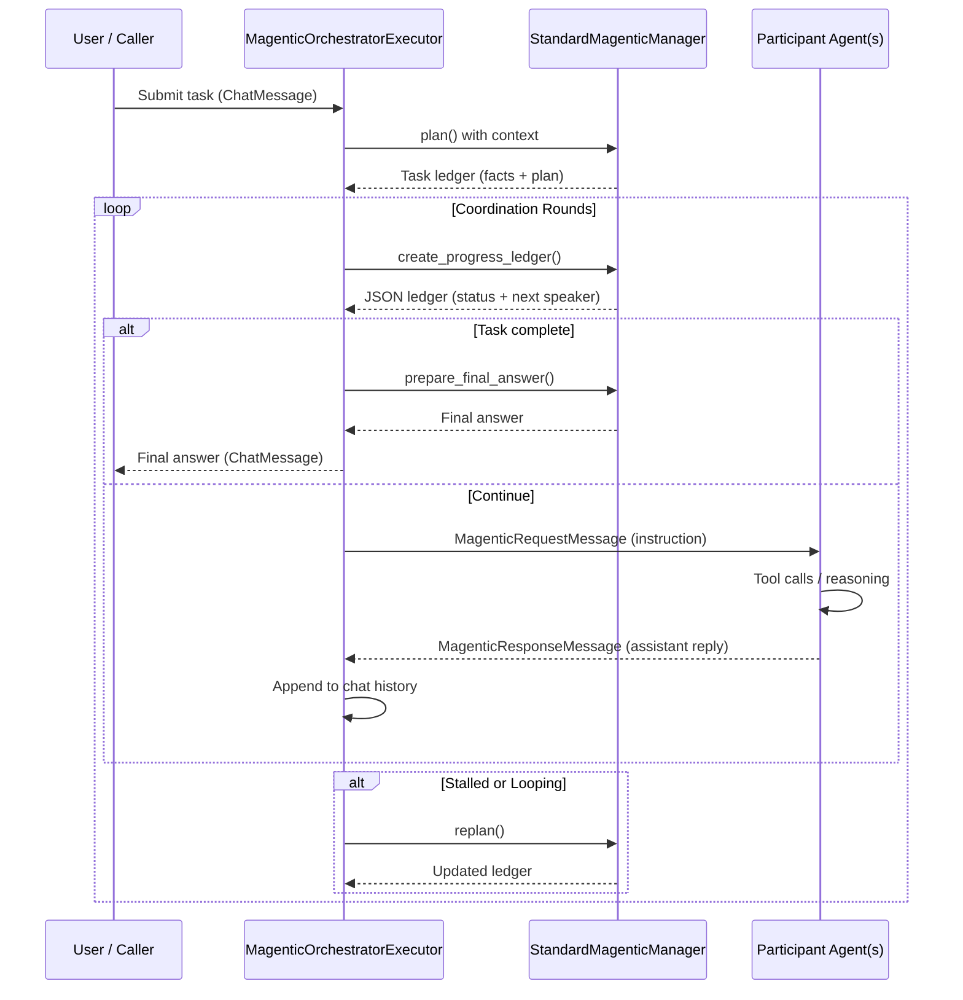

# Magentic Orchestration Playbook

This guide walks through the Magentic coordination flow implemented in the Microsoft Agent Framework—from the planner’s first fact-finding prompt to the final answer delivered back to the caller. It is meant for practitioners who are integrating or debugging Magentic-based teams inside the `agentic_ai` workspace.

---

## 1. High-Level Architecture

Magentic orchestrates a team by pairing a *manager* (the planner) with one or more *participants* (domain agents). The orchestration logic is owned by:

- [`StandardMagenticManager`](reference/agent-framework/python/packages/main/agent_framework/_workflow/_magentic.py)  
  Calls the underlying chat model to gather facts, build plans, evaluate progress, and synthesize the final answer.

- [`MagenticOrchestratorExecutor`](reference/agent-framework/python/packages/main/agent_framework/_workflow/_magentic.py)  
  Implements the coordination loop—routing manager instructions to participants, collecting agent responses, and deciding when to reset or finish.

- [`MagenticAgentExecutor`](reference/agent-framework/python/packages/main/agent_framework/_workflow/_magentic.py)  
  Wraps each participant agent (e.g., your MCP-enabled assistants) so they can participate in the workflow graph.

- [`MagenticBuilder`](reference/agent-framework/python/packages/main/agent_framework/_workflow/_magentic.py)  
  Glues the executors together, wires callbacks, and optionally adds checkpointing or human plan review.

### Overview Sequence



> **Key idea:** The manager (planner) never inspects internal tool state; it only reads what the orchestrator records in the shared chat history.

---

## 2. Collaboration Cycle

Each round uses the following surface types:

| Stage | Message Type | Implemented in |
|-------|--------------|----------------|
| User kickoff | [`MagenticStartMessage`](reference/agent-framework/python/packages/main/agent_framework/_workflow/_magentic.py) | Orchestrator `handle_start_message` |
| Planner output | [`MagenticTaskLedger`](reference/agent-framework/python/packages/main/agent_framework/_workflow/_magentic.py) | Manager `plan()` / `replan()` |
| Progress evaluation | [`MagenticProgressLedger`](reference/agent-framework/python/packages/main/agent_framework/_workflow/_magentic.py) | Manager `create_progress_ledger()` |
| Participant instruction | [`MagenticRequestMessage`](reference/agent-framework/python/packages/main/agent_framework/_workflow/_magentic.py) | Orchestrator `_run_inner_loop_locked` |
| Participant reply | [`MagenticResponseMessage`](reference/agent-framework/python/packages/main/agent_framework/_workflow/_magentic.py) | Agent executor `handle_request_message` |
| Final response | `ChatMessage` | Manager `prepare_final_answer()` |

**Round flow**

1. **Plan** (`plan()`): gather facts, produce bullet plan, store in `MagenticTaskLedger`.
2. **Evaluate** (`create_progress_ledger()`): JSON schema indicates completion status, loops, next speaker, and instruction.
3. **Act** (`MagenticRequestMessage`): orchestrator routes the instruction to the selected agent.
4. **Observe** (`MagenticResponseMessage`): agent reply is appended to `chat_history`.
5. **Reset if needed** (`replan()` + `reset()`): triggered when the ledger reports stalling or loops.

---

## 3. Prompts and Reasoning Surfaces

The manager relies on explicit prompts defined alongside the implementation. Understanding them is crucial when customizing planner behavior.

### 3.1 Task Ledger (Facts & Plan)

Defined at [`ORCHESTRATOR_TASK_LEDGER_FACTS_PROMPT`](reference/agent-framework/python/packages/main/agent_framework/_workflow/_magentic.py) and [`ORCHESTRATOR_TASK_LEDGER_PLAN_PROMPT`](reference/agent-framework/python/packages/main/agent_framework/_workflow/_magentic.py). The combined message is sent back to agents via [`task_ledger_full_prompt`](reference/agent-framework/python/packages/main/agent_framework/_workflow/_magentic.py).

```text
We are working to address the following user request:

{task}

...

Here is the plan to follow as best as possible:

{plan}
```

### 3.2 Progress Ledger Prompt

[`ORCHESTRATOR_PROGRESS_LEDGER_PROMPT`](reference/agent-framework/python/packages/main/agent_framework/_workflow/_magentic.py) forces the model to return JSON:

```text
Please answer the following questions ... Output an answer in pure JSON:
{
    "is_request_satisfied": { "reason": string, "answer": boolean },
    "is_in_loop": { "reason": string, "answer": boolean },
    ...
}
```

The orchestrator parses this response via `_extract_json()` and `MagenticProgressLedger.model_validate`.

### 3.3 Replan Prompts

When stalling, the manager calls `replan()`, which uses [`ORCHESTRATOR_TASK_LEDGER_FACTS_UPDATE_PROMPT`](reference/agent-framework/python/packages/main/agent_framework/_workflow/_magentic.py) and [`ORCHESTRATOR_TASK_LEDGER_PLAN_UPDATE_PROMPT`](reference/agent-framework/python/packages/main/agent_framework/_workflow/_magentic.py) to adjust the plan.

---

## 4. Technical Deep Dive

### 4.1 Workflow Construction

[`MagenticBuilder`](reference/agent-framework/python/packages/main/agent_framework/_workflow/_magentic.py):

1. Registers **participants** (`participants()`), each either a `BaseAgent` or another `Executor`.
2. Configures the **manager** (`with_standard_manager()`).
3. Optionally enables **plan review**, **checkpointing**, and **unified callbacks**.
4. Builds a [`Workflow`](reference/agent-framework/python/packages/main/agent_framework/_workflow/_workflow.py) graph: orchestrator (start node), optional `RequestInfoExecutor` for plan review, and bidirectional edges to each agent executor.

### 4.2 Workflow Context & State

- [`MagenticContext`](reference/agent-framework/python/packages/main/agent_framework/_workflow/_magentic.py) tracks the orchestrator’s runtime state—chat history, round counters, stall counts, and participant descriptions.
- On each run, both orchestrator and agent executors call `snapshot_state()` / `restore_state()` to support checkpointing via the `WorkflowBuilder.with_checkpointing()` path.

### 4.3 Execution Hooks

Inside [`MagenticOrchestratorExecutor`](reference/agent-framework/python/packages/main/agent_framework/_workflow/_magentic.py):

- `handle_start_message()` arranges first plan creation.
- `_run_inner_loop_locked()` enforces serialization and calls `create_progress_ledger()`.
- `_reset_and_replan()` clears participant state and re-enters the outer loop.

Agent executors translate `MagenticRequestMessage` into a call to the wrapped `BaseAgent`’s `run_stream()`, surface streaming updates via callbacks (optional), and forward the final `ChatMessage` upstream.

---

## 5. Extensibility Considerations

| Scenario | Where to customize | Notes |
|----------|-------------------|-------|
| Change planner prompts | Override fields when constructing [`StandardMagenticManager`](reference/agent-framework/python/packages/main/agent_framework/_workflow/_magentic.py) | e.g., `.with_standard_manager(chat_client=..., task_ledger_plan_prompt=...)` |
| Inspect tool outcomes mid-round | Provide `streaming_agent_response_callback` via [`MagenticBuilder.on_event`](reference/agent-framework/python/packages/main/agent_framework/_workflow/_magentic.py) or instrument your agents to summarize tool results in their final reply | Planner only sees the shared `chat_history`. |
| Add new participants or roles | Extend [`MagenticBuilder.participants`](reference/agent-framework/python/packages/main/agent_framework/_workflow/_magentic.py) | Keys must remain stable for checkpoint recovery. |
| Persist richer state | Implement custom `CheckpointStorage` and enable `.with_checkpointing(storage)` | Ensures `MagenticContext` and agent histories survive restarts. |
| Human in the loop plan review | Call `.with_plan_review(True)` and handle [`MagenticPlanReviewReply`](reference/agent-framework/python/packages/main/agent_framework/_workflow/_magentic.py) | Orchestrator pauses after `plan()`, awaits approval or edits. |

---

## 6. Related Files in `agentic_ai`

These modules show concrete Magentic integrations built atop the framework:

- [`magentic_group.py`](agentic_ai/agents/agent_framework/multi_agent/magentic_group.py) — multi-specialist “selector” team using MagenticBuilder.
- [`handoff_multi_domain_agent.py`](agentic_ai/agents/agent_framework/multi_agent/handoff_multi_domain_agent.py) — coordinator-responder setup with handoffs and workflow checkpoints.
- [`single_agent.py`](agentic_ai/agents/agent_framework/single_agent.py) — reference single-agent loop with MCP tooling.

---

## 7. Operational Guidelines

### 7.1 Before You Build
- **Clarify participant charters.** Write down what each agent owns, the systems they access, and the guardrails they must respect. Feed those descriptions directly into [`MagenticBuilder.participants`](reference/agent-framework/python/packages/main/agent_framework/_workflow/_magentic.py) and into the manager instructions so the planner knows who does what.
- **Set orchestrator expectations.** In the manager `instructions` (see [`with_standard_manager`](reference/agent-framework/python/packages/main/agent_framework/_workflow/_magentic.py)), spell out the collaboration rules: when to delegate, how to synthesize findings, and what constitutes a finished answer (e.g., “return `FINAL_ANSWER:` plus a summary and open questions”).
- **Decide on human oversight early.** If stakeholders want visibility into the plan, enable `.with_plan_review(True)` and route [`MagenticPlanReviewRequest`](reference/agent-framework/python/packages/main/agent_framework/_workflow/_magentic.py) messages to your review surface before you ever run in production.

### 7.2 During Runtime
- **Protect the loop with limits.** Tune [`max_round_count`](reference/agent-framework/python/packages/main/agent_framework/_workflow/_magentic.py), [`max_stall_count`](reference/agent-framework/python/packages/main/agent_framework/_workflow/_magentic.py), and [`max_reset_count`](reference/agent-framework/python/packages/main/agent_framework/_workflow/_magentic.py) to match SLAs. Lower bounds keep runaway conversations from exhausting tokens; higher bounds give long investigations room to breathe.
- **Capture tool context in replies.** Because the planner only sees `chat_history`, teach each participant agent to summarize tool outcomes in its final message (“Lookup returned status=404”). This makes the progress ledger loop far more reliable without modifying the orchestrator.
- **Leverage checkpoints for resilience.** When workflows may span minutes or cross infrastructure boundaries, plug in a durable `CheckpointStorage` (e.g., Redis, Cosmos DB). [`MagenticBuilder.with_checkpointing`](reference/agent-framework/python/packages/main/agent_framework/_workflow/_magentic.py) ensures orchestrator and participant state can resume mid-run.
- **Stream for observability.** Register `on_event` callbacks to forward `MagenticRequestMessage` / `MagenticResponseMessage` payloads to dashboards. Observability makes plan resets and tool failures obvious during ops reviews.

### 7.3 Quick-Start Checklist
1. Define participant agents with concise instructions and register them via `builder.participants(...)`.
2. Craft manager instructions that reinforce delegation strategy and final-answer format, then call `builder.with_standard_manager(...)`.
3. Configure guardrails (rounds, stalls, resets) plus optional plan review or callbacks.
4. Enable checkpointing when conversations must survive restarts.
5. Teach agents to narrate tool results so the progress ledger always has fresh evidence.

## 8. Summary

1. **Planner-first approach**: a single LLM-driven manager creates a fact sheet and plan, then continuously reassesses progress via a structured JSON ledger.
2. **Participants remain black boxes**: only published responses enter the shared history; internal tool traces must be surfaced manually if needed.
3. **Workflow backbone**: `MagenticBuilder` integrates the manager and agents into the framework’s `Workflow` graph, providing checkpoints, callbacks, and optional plan review.

Leverage this document when you onboard new developers, debug coordination issues, or customize Magentic teams for your scenarios.