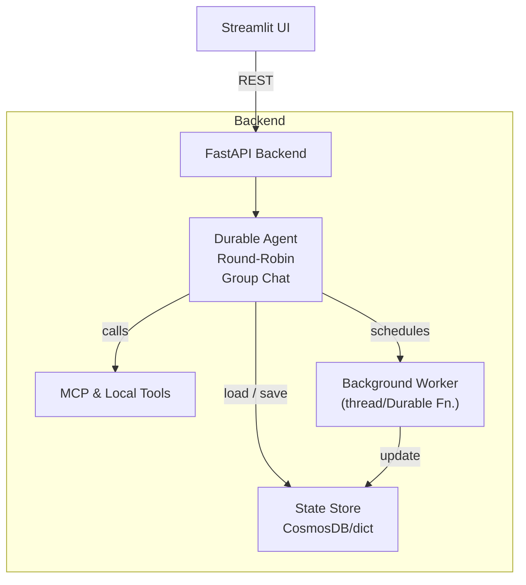

# Durable-Agent Demo 🚀  
  
> An experiment in making **AI agents durable** – i.e. able to  
> preserve state, survive crashes / restarts and handle long-running  
> workflows without blocking.  
  
---  
  
## 1.  Why “durable” agents?  
  
Normal conversational agents keep all their short-term memory **in RAM**.  
If the process dies, the whole context is lost.  Durable agents, in contrast, are designed to:  
  
1. **Persist state** – every turn they write their internal state to an external store (Cosmos DB in Azure or an in-memory dict for local runs).  
2. **Resume seamlessly** – on the next request they reload that state and continue the conversation exactly where they left off.  
3. **Survive long-running work** – they can kick off background jobs or remote orchestrations (Azure Durable Functions, workflows, etc.), go completely idle, and later integrate the result back into the conversation once it is available.  
  
These three abilities together make a durable agent *resilient*, *tolerant to infra hiccups*, and *suitable for complex, multi-step business flows*.  
  
---  
  
## 2.  High-level architecture  
  

## 3. Sequence of a long-running operation

```mermaid
sequenceDiagram  
    participant U as User (UI)  
    participant BE as FastAPI  
    participant AG as Durable Agent  
    participant BG as Background Job  
    participant SS as State Store  
  
    U->>BE: "Activate line …"  
    BE->>AG: chat(task)  
    AG->>AG: tool call activate_new_line  
    AG->>BG: spawn thread & return  
    AG->>SS: save state  
    AG->>BE: "Task scheduled, please wait…"  
    BE->>U: immediate reply  
  
    Note over BG: ~long running task  
    BG-->>SS: append result message  
  
    U->>BE: "Is it done?"  
    BE->>AG: chat(next turn)  
    AG->>SS: load state (+result)  
    AG-->>BE: "✅ Done, line is active."  
    BE-->>U: final reply      
```

## 4. Current Demo – What is Implemented?  
  
| Capability                           | Status | Notes                                                                                                  |  
|---------------------------------------|:------:|--------------------------------------------------------------------------------------------------------|  
| Resilient state persistence           |   ✅   | Cosmos DB or in-mem dict                                                                               |  
| Autogen agent re-hydration            |   ✅   | Agent loads TeamState on every request                                                                 |  
| Long-running tool scheduling          |   ✅   | Simulated via Python threading (20 s sleep)                                                            |  
| Result injection after completion     |   ✅   | Worker edits saved state (`FunctionExecutionResultMessage`)                                            |  
| Push notifications to UI (SSE)        |   ♻️   | Optional add-on shown in docs                                                                          |  
| Integration with Azure Durable Fn.    |   🟡   | Conceptually supported; not wired-up in repo                                                           |  
| Full error-handling / retries         |   🟡   | Basic happy-path only                                                                                  |  
  
---  
  
## 5. Code Hotspots  
  
- **agents/base_agent.py**    
  Abstract helper that reads env-vars and exposes `chat_async`.  
  
- **agents/durable_agent/loop_agent.py**    
  - Builds an Autogen `RoundRobinGroupChat` with one `AssistantAgent`.  
  - Registers normal MCP tools and a custom long-running tool `activate_new_line`.  
  - Spawns a background thread that, after the fake 20 s delay, loads the saved `TeamState`, injects a synthetic `ToolCallRequestEvent` plus matching `ToolCallExecutionEvent`, and rewrites the state.  
  
- **utils/CosmosDBStateStore**    
  Thin wrapper around Cosmos container ⇒ “dict-like” API.  
  
- **backend.py**    
  FastAPI endpoints:    
  `/chat`, `/history/{id}`, `/reset_session`.    
  (Optional) `/events/{id}` for Server-Sent Events push.  
  
---  
  
## 6. Extending the Pattern  
  
- Swap the background threading code for Azure Durable Functions or Azure Container Apps Jobs – post the final status to the same state store key.  
- Support multiple parallel long-running calls by including a unique tool `call_id` per job; each worker injects its own result message.  
- Add retry metadata (e.g. “attempt #”, “next ETA”) inside the state so the agent can reason about failures and keep the user informed.  
- Implement push UI (SSE / WebSockets) for real-time updates without polling.  
  
---  
  
## 7. Limitations & Next Steps  
  
- Persisted messages grow indefinitely – add TTL / pruning.  
- Background thread approach works only for single-process deployments – use external orchestrators in prod.  
- No security model yet (authN / authZ on APIs, encrypt Cosmos).  

