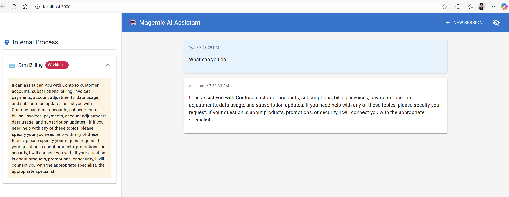

# Part 3: Frontend Setup with React

## Pre-requisites
- Complete [Part 0](../SETUP.md)
- Complete [Part 1: MCP Setup](01_mcp_uv.md) or [Part 1: MCP Setup (pip)](01_mcp_pip.md)
- Complete [Part 2: Backend Setup](02_backend_uv.md) or [Part 2: Backend Setup (pip)](02_backend_pip.md)
- Backend service running on `http://localhost:7000`
- MCP server running on `http://localhost:8000/mcp`

## Summary
In this part, you will set up and run the React frontend for the Microsoft AI Agentic Workshop. The React frontend provides advanced streaming visualization ideal for Microsoft Agent Framework agents with real-time token-by-token streaming and internal agent process visibility.

**Best for:** Microsoft Agent Framework agents, real-time streaming, viewing orchestrator planning and tool calls, development and debugging.

## Steps
[1. Install Node.js](#1-install-nodejs)  
[2. Configure frontend (optional)](#2-configure-frontend-optional)  
[3. Install dependencies and start React frontend](#3-install-dependencies-and-start-react-frontend)

### 1. Install Node.js

The React frontend requires Node.js 16+ and npm.

> **Action Items:**
> Open a new terminal window separate than the one running the MCP server and backend.
> 
> Check if you have Node.js and npm installed:
> ```bash
> node --version  # Should be v16 or higher
> npm --version   # Should be v8 or higher
> ```
> 
> If not installed, choose one of the following installation methods:
> - **Windows/macOS/Linux:** Download and install from [https://nodejs.org/](https://nodejs.org/) (Download the LTS version)
> - **Windows (alternative):** Use `winget install OpenJS.NodeJS.LTS`
> - **macOS (alternative):** Use `brew install node`

### 2. Configure frontend (optional)

The React frontend connects to `http://localhost:7000` by default.

> **Action Items (Optional):**
> To customize the backend URL, create a `.env` file in the `react-frontend` directory:
> ```bash
> # react-frontend/.env
> REACT_APP_BACKEND_URL=http://localhost:7000
> ```

### 3. Install dependencies and start React frontend

> **Action Items:**
> Navigate to the React frontend directory from `agentic_ai/applications`:
> ```bash
> cd react-frontend
> ```
> 
> Install dependencies (first time only, or after package.json changes):
> ```bash
> npm install
> ```
> 
> Start the development server:
> ```bash
> npm start
> ```
> 
> The React app will automatically open at `http://localhost:3000`. If it doesn't open automatically, navigate to `http://localhost:3000` in your browser.

## Success criteria
- React frontend is running on `http://localhost:3000`
- Frontend successfully connects to backend on `http://localhost:7000`
- You can interact with the AI agent through the chat interface
- Real-time streaming and agent process visibility are working

    

## Troubleshooting
- **Port 3000 already in use?** The React app will prompt you to use a different port. Type `Y` to accept.
- **npm install fails?** Try clearing npm cache: `npm cache clean --force` and retry.
- **WebSocket connection errors?** Ensure the backend is running on port 7000 and firewall isn't blocking connections.

**Next Step**: If you successfully completed all the steps, setup is complete and your agent should be running! Read more about [how it works →](04_how_it_works.md)
