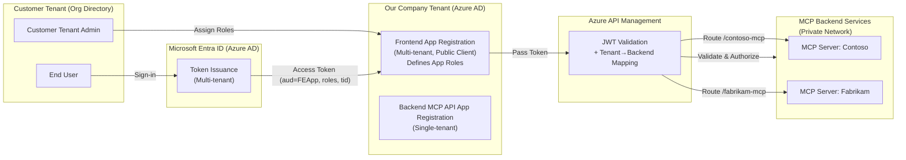
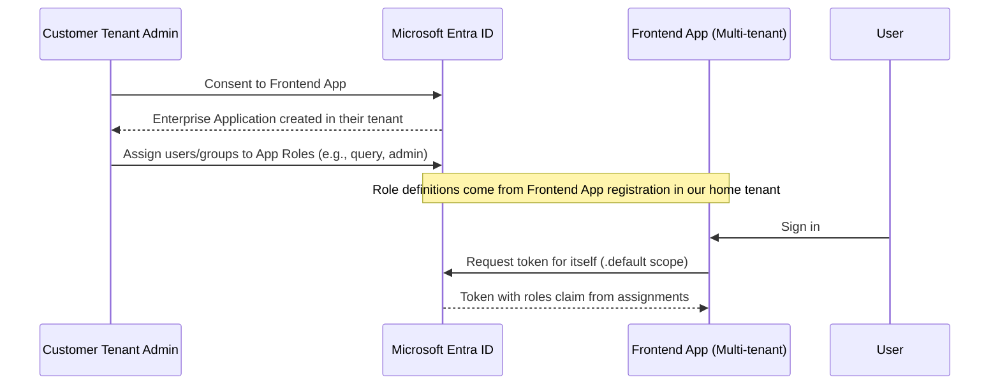

# Multi‑Tenant MCP Service Access Design  
  
## **Business Goal**  
We want to **expose a company’s MCP (Managed Control Platform) services** to **external customer organizations** so their users can consume these services securely.  
  
- **Multi‑tenant**: Many customer organizations (tenants) can use the same platform.  
- **Role-based access**: Customer tenant admins assign roles to their users.  
- **Tenant-to-service mapping**: Certain tenants can only access certain backend MCP servers.  
- **Defense in depth**: Multiple layers of security — Authentication via Microsoft Entra ID, coarse-grained access control in APIM, fine-grained role logic in backend MCP servers.  
  
---  
  
## **High-Level Architecture**  

  
---  
  
## **Role Assignment Process**  

  
---  
  
## **Design Flow**  
  
### 1. **User Authentication**  
- A **Frontend App** is registered in our **Home Tenant** as **multi-tenant**.  
- The app defines **App Roles** (e.g., `query`, `admin`, etc.).  
- When a **Customer Tenant Admin** consents to the app, Azure AD creates an **Enterprise Application** in their tenant.  
- The admin assigns their users/groups to roles in that Enterprise App.  
  
### 2. **Token Issuance**  
- The **Frontend App** uses **MSAL** to sign in users and request a token **for itself**:  
  ```  
  scopes = [ "<frontend-client-id>/.default" ]  
  ```  
- Azure AD issues a **v2.0 access token** containing:  
  - `aud` = **Frontend App Client ID**  
  - `tid` = Tenant ID of the customer organization  
  - `roles` = Roles assigned in customer’s Enterprise App  
  
### 3. **APIM Layer — Coarse-Grained Access Control**  
- **APIM** is the only public entry point to MCP backend services.  
- The **validate-jwt** policy:  
  - Validates the token against Azure AD’s `common/v2.0` endpoint.  
  - Requires `aud` = frontend app’s client ID.  
- Extracts `tid` from token.  
- Checks **Tenant→Backend mapping**:  
  - Example mapping:  
    ```  
    tid: 0fbe7234-...  →  /contoso-mcp  →  MCP Server: Contoso  
    tid: 11111111-...  →  /fabrikam-mcp →  MCP Server: Fabrikam  
    ```  
- If tenant is not allowed for the requested backend route → `403 Forbidden`.  
- **Rewrites** URI to the internal MCP service address.  
  
### 4. **Backend Layer — Fine-Grained Access Control**  
- Backend MCP servers are **not internet-accessible** — only APIM can reach them (via VNet / private endpoint / IP allowlist).  
- The same token from the frontend is passed to the backend.  
- Backend:  
  - Validates `aud` = frontend app client ID.  
  - Reads `roles` claim from token.  
  - Applies **custom business logic** based on role (e.g., `query` can read data, `admin` can modify).  
  
---  
  
## **Security Layers**  
1. **Authentication**:  
   - Microsoft Entra ID (multi-tenant) via the frontend app.  
2. **Authorization Layer 1 (APIM)**:  
   - Validates token authenticity.  
   - Enforces **tenant→backend mapping**.  
3. **Authorization Layer 2 (Backend MCP)**:  
   - Uses `roles` for fine-grained access control.  
4. **Network Security**:  
   - MCP backends only accessible from APIM.  
  
---  
  
## **Key Design Choices**  
- **Roles defined in Frontend App**:  
  - Allows each customer tenant admin to manage role assignments in their own directory.  
  - Roles appear in tokens issued for the frontend (which backend trusts).  
- **Frontend is Multi-Tenant**:  
  - Users from any tenant can authenticate (after consent).  
- **Backend is Single-Tenant**:  
  - Not directly accessible to external tenants.  
  - Only APIM can call it.  
- **APIM as Security Gateway**:  
  - Enforces tenant→backend mapping.  
  - Rejects unauthorized tenants before requests hit backend.  
  
---  
  
## **Example**  
**Tenant A** user → has role `query` in frontend app.  
  
Flow:  
1. Signs into frontend → gets token:  
   ```  
   aud = <frontend-client-id>  
   tid = TenantA-ID  
   roles = ["query"]  
   ```  
2. Calls APIM `/contoso-mcp/...` → APIM sees:  
   - tid matches mapping for `/contoso-mcp`  
   - Token valid → forwards to MCP: Contoso  
3. Backend sees `roles=["query"]` → grants read-only data access.  
  
---  
  
## **Future Enhancements**  
- Store Tenant→Backend mapping in **APIM Named Values** or **Azure App Configuration** for dynamic updates.  
- Use **APIM caching** for mapping lookups.  
- Implement **Conditional Access** in Azure AD for extra security (MFA, device compliance).  
- Add **PoP tokens** or **mTLS** between APIM and backends for stronger binding.  
  
