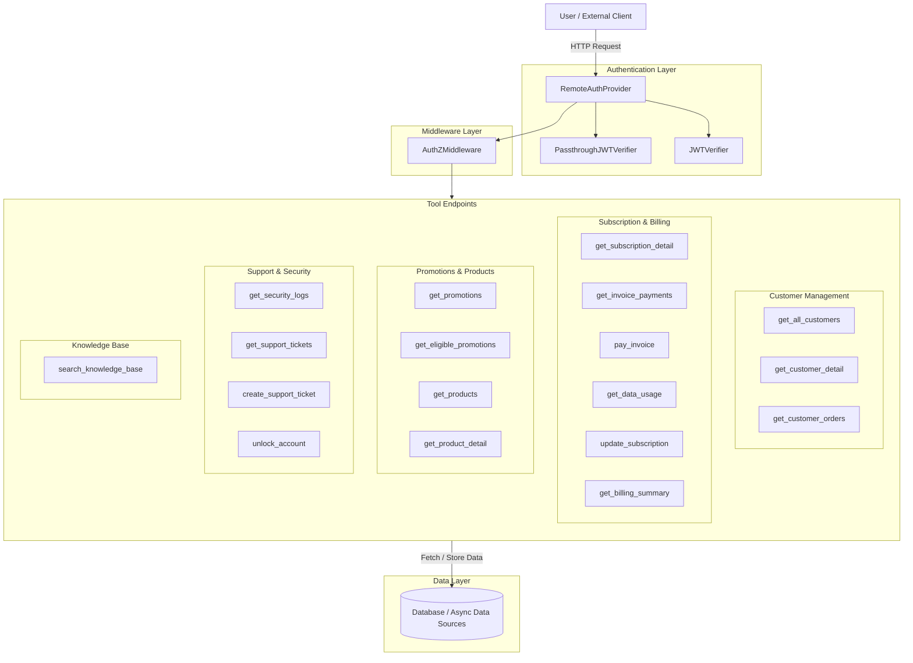

This chapter explain about MCP design.
talks about following topics:
1. MCP Security: basic security and multi-tenant security with APIM integration
2. Agentic MCP: intelligent MCP 
3. Advanced features such as progress update 
## MCP Server Architecture
