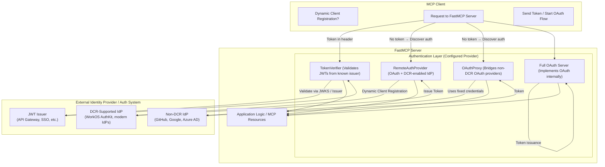

# MCP Design Guidance for Secure, Intelligent, and Advanced MCP Services  
  
## Overview  
This repository illustrates how to design and operate production-grade MCP services that are:  
  
- **Secure by default** and ready for multi-tenant exposure via Azure API Management (APIM).  
- **Intelligent and agentic**, using Azure OpenAI and Autogen to orchestrate tool calls.  
- **Advanced in user experience**, including long-running operations with live progress updates.  
  
---  
 
## Quickstart with uv ⚡

The MCP module now ships with a `pyproject.toml` and `uv.lock`, so you can manage environments with the
[uv](https://github.com/astral-sh/uv) package manager:

```cmd
cd mcp
uv sync          # create/refresh the virtual environment from pyproject + uv.lock
uv run python mcp_service.py
```

When dependencies change, regenerate the compiled requirements file so Docker builds stay deterministic:

```cmd
uv pip compile pyproject.toml -o requirements.txt
```

`uv run` works with any entry-point, e.g. `uv run python mcp_service_agentic.py` for the agentic server.
  
  
## MCP Security: Basic Security and Multi‑Tenant Security with APIM Integration  
  
### Goals  
- Ensure any client (human or system) authenticates and authorizes correctly.  
- Enforce defense-in-depth with a gateway (APIM) and the MCP backend.  
- Support multi-tenant customers with clear tenant-to-backend routing and role-based access.  
  
### Core Patterns Demonstrated  
  
#### Authentication on the MCP Server  
- `RemoteAuthProvider` publishes OAuth-protected-resource metadata so clients discover how to authenticate.  
- **Token verification options**:  
  - `JWTVerifier` (**production**): Validates tokens with Entra ID (JWKS) and optional audience enforcement.  
  - `PassthroughJWTVerifier` (**development**): Accepts any token so you can simulate roles/scopes locally.  
  - `DISABLE_AUTH` (**development**): Turns off auth entirely.  
- **OAuth discovery endpoint for clients**:    
  `GET /mcp/.well-known/oauth-protected-resource` returns resource, auth servers, scopes.  
  
#### Authorization in the MCP Server  
- `AuthZMiddleware` inspects `token.claims["roles"]` and applies fine-grained RBAC:  
  - Restricted tools (e.g., `unlock_account`) require a specific role (`SECURITY_ROLE="security"` by default).  
  - Tools are filtered on list and enforced on call, preventing accidental exposure.  
  
#### APIM as Security Gateway (Coarse-Grained Control)  
- APIM `validate-jwt` policy verifies Bearer tokens from Entra ID.  
- Requires audience and only allows specific tenant IDs (`tid`) per route.  
- Performs tenant → backend mapping (e.g., `/contoso-mcp` → Contoso backend).  
- Blocks disallowed tenants with **403** before traffic reaches the MCP server.  
  
---  
 
### General MCP Security Model  
The following diagram summarizes the pluggable authentication and authorization components available for an MCP server. It shows how different inbound authentication strategies (direct JWT verification, remote OAuth discovery with dynamic client registration, proxying to a non‑DCR IdP, or hosting a full OAuth server) all converge before application logic executes.  



---  
  
### Multi-Tenant Design Flow  
*(Detailed in [MULTI_TENANT_MCP_SECURITY.md](./MULTI_TENANT_MCP_SECURITY.md))*  
  
1. A multi-tenant “frontend” app in your home tenant defines app roles.  
2. Customer tenant admins consent and assign their users to roles in their Enterprise App.  
3. The frontend acquires tokens (`aud = frontend app`) and calls APIM.  
4. APIM validates tokens, checks `tid` mapping, and forwards to the correct MCP backend.  
5. MCP backend re-validates, reads roles, and applies business rules (e.g., read-only vs privileged actions).  
  
#### Why This Matters  
- **Two robust authorization layers**:  
  - **At the edge (APIM)**: Tenant allow-listing and routing.  
  - **In the app (MCP)**: Role-based tool exposure and enforcement.  
- **Clean separation of concerns**:    
  - Identity and coarse-grained access → Gateway    
  - Business logic and fine-grained rules → MCP  
  
---  
  
## Agentic MCP: Intelligent MCP  
  
### Goals  
- Move beyond “single tool calls” into expert, multi-step reasoning that uses the right tool(s) at the right time.  
- Keep tools simple and auditable, but let agents orchestrate them to solve complex tasks.  
  
### Core Patterns Demonstrated  
  
#### Agentic Server Powered by Azure OpenAI + Autogen  
- **Domain-specialized agents**:  
  - Billing  
  - Account/Security  
  - Product/Promotions  
- MCP tools such as `ask_billing_expert`, `ask_account_expert`, and `ask_product_expert` expose these agents via a simple question interface.  
- Agents select and chain domain-appropriate tools (e.g., invoices, usage, promotions) to form end-to-end solutions.  
- **State persistence per session** allows multi-turn flows (agent remembers context).  
  
#### Clear Boundary Between “Tools” and “Agents”  
- **Tools**: Minimal, typed, map to specific business operations (queries and updates).  
- **Agents**: Decide which tools to call, in what order, and when to ask clarifying questions.  
  
#### Enterprise-Friendly Data Layer  
- Backed by deterministic, seeded SQLite DB with realistic tables:  
  - Customers, subscriptions, invoices, payments, support tickets, usage, promotions, incidents, security logs, knowledge base.  
- Knowledge base search uses embeddings (with zero-vector fallback if Azure OpenAI credentials aren’t available).  
  
#### Why This Matters  
- Preserves operational clarity (tools) while adding intelligent orchestration (agents).  
- Extends cleanly to more domains—just add tools and a domain agent.  
  
---  
  
## Advanced MCP Features: Progress Updates with Agent Integration  
  
### Goals  
- Provide great UX and trust signals during long-running tasks.  
- Allow clients (UI or systems) to present real-time progress and partial status.  
  
### Core Patterns Demonstrated  
  
#### Long-Running Tool with Progress  
- Example: `trouble_shoot_device` emits progress via    
  `ctx.report_progress(progress, total, message)`    
  as it runs through multiple steps (~45s).  
- Integrates with agent flows—agents can call such tools and surface progress to clients.  
  
#### Stream-Friendly Server Middlewares (Agentic Server)  
- Logging, timing, and error-handling middleware make operations observable without overwhelming logs.  
- Works with streaming transports (e.g., SSE) so UIs can reflect progress live.  
  
#### Typed Interfaces and Consistent Contracts  
- All tools use explicit schemas (Pydantic models) for inputs and outputs.  
- Agents and clients can rely on predictable structures for rendering and automation.  
  
#### Why This Matters  
- Users remain informed during complex tasks (diagnostics, data sync, batch updates).  
- Improves perceived performance and reduces support burden.  
  
---  
  
## How These Patterns Map to This Repository  
  
### Security & Multi-Tenant  
- **MCP tools server**: `mcp_service.py`    
  (`RemoteAuthProvider`, `JWTVerifier`/`Passthrough`, `AuthZMiddleware`, OAuth metadata route)  
- **APIM policy**: `apim_inbound_policy.xml` (audience, tenant allow-list)  
- **Design doc**: [`MULTI_TENANT_MCP_SECURITY.md`](./mcp/MULTI_TENANT_MCP_SECURITY.md)    
- **General auth choices**: [`general_mcp_security.md`](`general_mcp_security.md`)  
  
### Agentic Intelligence  
- **Agentic server**: `mcp_service_agentic.py` (Autogen + Azure OpenAI)  
- **Domain orchestration**: `ask_billing_expert`, `ask_account_expert`, `ask_product_expert`  
- **Shared tools/data**: `contoso_tools.py` (async DB + KB functions)  
- **Database seed**: `data/create_db.py`  
  
### Advanced Features  
- **Progress reporting**: `trouble_shoot_device` with `ctx.report_progress`  
- **Observability**: Logging/timing/error middleware  
- **Typed contracts**: Pydantic models across all tool endpoints  
  
---  
  
## Adoption Checklist  
  
### Edge Security (APIM)  
- Require `aud` and `tid`; maintain tenant → backend mapping.  
- Add URI rewrite/routing for per-tenant or per-business-unit MCPs.  
  
### Backend Security (MCP)  
- Use real JWT verification (Entra ID JWKS); disable passthrough in production.  
- Enforce role-based tool access; audit/alert on restricted tool usage.  
  
### Agentic Enablement  
- Identify core domains and write small, composable tools.  
- Add domain agents that know which tools matter and how to combine them.  
  
### User Experience & Operations  
- For any long-running job, report structured progress regularly.  
- Keep typed inputs/outputs for consistent automation and UIs.  
- Add logging/timing middleware for predictable performance in production.  
