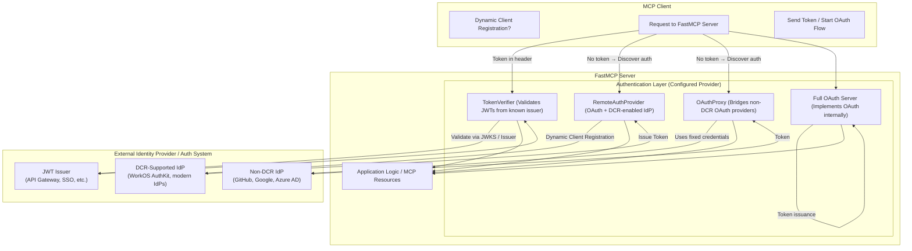

### General MCP Security Model

```mermaid
flowchart TD  
    subgraph Client["MCP Client"]
        DCR[Dynamic Client Registration?]  
        Request[Request to FastMCP Server]  
        Tokens[Send Token / Start OAuth Flow]  
    end  
  
    subgraph Server["FastMCP Server"]
        subgraph AuthLayer["Authentication Layer (Configured Provider)"]
            TV["TokenVerifier (Validates JWTs from known issuer)"]
            RAP["RemoteAuthProvider (OAuth + DCR-enabled IdP)"]
            OAP["OAuthProxy (Bridges non-DCR OAuth providers)"]
            FOS["Full OAuth Server (Implements OAuth internally)"]
        end  
        AppLogic[Application Logic / MCP Resources]  
    end  
  
    subgraph External["External Identity Provider / Auth System"]
        JWTIssuer["JWT Issuer\n(API Gateway, SSO, etc.)"]
        DCRIdP["DCR-Supported IdP\n(WorkOS AuthKit, modern IdPs)"]
        NonDCRIdP["Non-DCR IdP\n(GitHub, Google, Azure AD)"]
    end

    %% Flow for TokenVerifier  
    Request -->|Token in header| TV  
    TV -->|Validate via JWKS / Issuer| JWTIssuer  
    JWTIssuer --> TV  
  
    %% Flow for RemoteAuthProvider  
    Request -->|No token → Discover auth| RAP  
    RAP -->|Dynamic Client Registration| DCRIdP  
    DCRIdP -->|Issue Token| RAP  
  
    %% Flow for OAuthProxy  
    Request -->|No token → Discover auth| OAP  
    OAP -->|Uses fixed credentials| NonDCRIdP  
    NonDCRIdP -->|Token| OAP  
  
    %% Flow for Full OAuth  
    Request --> FOS  
    FOS -->|Internal login / consent| FOS  
    FOS -->|Token issuance| FOS  
  
    %% Common path after auth  
    TV --> AppLogic  
    RAP --> AppLogic  
    OAP --> AppLogic  
    FOS --> AppLogic  
```